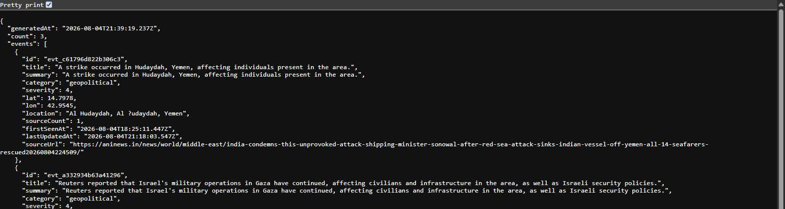

# MassifyX Intelligence Service (MIS)

**A decoupled AI microservice that turns the raw GDELT global-events feed into a
rate-limited, contract-tested API of classified, scored supply-chain
disruptions — with a live AIS ship-tracking layer, a cost-monitored LLM
enrichment pipeline, and zero runtime dependency on anything that can take
the consuming site down with it.**

Powers the `/live` disruption monitor on [MassifyX Global](https://github.com/Viraj97-SL/MassifyX_Global)
(see it in context on that site's `/live` and `/insights/sweden-trade` pages) — the site talks to this
service server-side only; its real deployment address is never exposed to a browser or published here,
by design (see `lib/misClient.js`'s docstring).

```bash
curl https://your-mis-deployment.example.com/api/v1/disruptions
```



*A real response shape from the deployed API — genuine GDELT-sourced, AI-enriched events, not a mock.*

## Related MassifyX Services

| Service | Repo | Role |
|---|---|---|
| 🌐 Site | [`MassifyX_Global`](https://github.com/Viraj97-SL/MassifyX_Global) | Public site this service's `/live` disruption monitor and `/insights/sweden-trade` page are powered by |
| 🕵️ War Room | [`massifyx-warroom`](https://github.com/Viraj97-SL/massifyx-warroom) *(private)* | LangGraph deep-agent investigation service — the other decoupled MassifyX microservice |

---

## What this is

A supply-chain buyer cares about port strikes, storms, and geopolitical
restrictions the moment they happen — but the raw source for that (GDELT,
a firehose of ~150k+ global news-derived events a day, in a 61-column
tab-separated export) is noise, not signal. This service is the pipeline
that turns that firehose into something a product can actually render:

```
GDELT export (raw, noisy, 61 cols)
        │  parse + geofilter
        ▼
raw candidate events
        │  AI enrichment: relevance → category → severity → summary
        ▼
classified, scored, deduplicated disruptions
        │  read-only, rate-limited, cache-headered API
        ▼
consuming site (renders a map + feed, degrades gracefully if this is down)
```

Built as an independent, separately-deployed microservice on purpose (see
**Why decoupled** below) — the site that consumes it has *zero* runtime
dependency on GDELT, on an LLM, or on this service being up at all.

## Skills & technical areas this project demonstrates

- **System design** — decoupled service boundary by design, not by accident:
  a stateless, always-up marketing site and a stateful, dependency-heavy
  data service are two different failure domains, so they're two different
  deployments. The site fetches this service's read API server-side and
  degrades to a clean "unavailable" state if it's slow, down, or
  misconfigured — see **Why decoupled**.
- **AI/LLM integration** — DeepSeek via a hand-rolled REST client (no
  SDK dependency), an injectable `llmCall` interface so the entire
  enrichment pipeline is unit-testable without a network call or a real key,
  timeout + retry resilience on every call, and a cost tripwire
  (`lib/costMonitor.js`) rather than an unmonitored blank cheque.
- **Data engineering / ETL** — a real ingest pipeline: fetch → parse a
  domain-specific flat-file format → geofilter → deterministic clustering
  (geo/date bucketing for a stable dedup key, no embedding call needed per
  cycle) → enrich → persist. Idempotent, retryable, and tested against
  recorded fixtures rather than the live network.
- **API design** — a small, deliberate read contract (`GET /api/v1/health`,
  `GET /api/v1/disruptions`, `GET /api/v1/vessels`), per-IP rate limiting,
  correct cache headers per endpoint, and a **shared contract test**
  (`lib/api/contractRules.js`) duplicated into the consuming site's own test
  suite so the two repos fail loudly on drift instead of silently
  diverging.
- **Real-time systems** — a WebSocket client for live AIS ship-position
  streaming (`aisstream.io`), with reconnect-with-backoff and an in-memory
  store that prunes stale positions itself (10 min) rather than growing
  unbounded.
- **Testing discipline** — 87 tests (`node:test`, no external test runner),
  every network/filesystem/time boundary is dependency-injected
  (`fetchImpl`, `unzipImpl`, `WebSocketImpl`, `llmCall`) specifically so the
  suite runs deterministically with zero real network calls. A separate,
  non-gating **eval harness** reports precision/recall on relevance and
  category classification against a hand-labelled fixture set — the kind of
  AI-quality signal that a pass/fail unit test can't give you.
- **Cloud deployment & ops** — deployed on Railway (Nixpacks auto-build, no
  Dockerfile needed), managed Postgres on Supabase accessed through its
  connection pooler (the direct hostname is IPv6-only and unreachable from
  Railway's network — diagnosed via DNS resolution, fixed by routing through
  Supavisor), CI on GitHub Actions across Node 18/20/22, a written
  operational runbook (`RUNBOOK.md`) for on-call-style triage.
- **Security-conscious defaults** — `helmet` CSP/security headers,
  per-IP rate limiting, only public contract fields ever serialized
  (internal fields like `relevanceScore` and raw source refs never leave
  this service), no secret ever crosses the boundary to the site — the only
  thing the two services share is a plain public URL.

## Tech stack

| Layer | Choice | Why |
| --- | --- | --- |
| Runtime | Node.js ≥20, plain CommonJS | No build step, no framework lock-in, matches the consuming site's own "no build step" philosophy |
| Web framework | Express 5 | Small read-only API surface; didn't need more |
| Database | PostgreSQL (Supabase, managed), accessed via `pg` | Hosts here (Railway) can have ephemeral filesystems — no local disk persistence, ever |
| AI / LLM | DeepSeek (`deepseek-chat`), raw REST — no SDK | Full control over retry/timeout/cost behaviour; one fewer opaque dependency |
| Real-time data | `ws` (WebSocket client) → aisstream.io | Free-tier live AIS ship positions, entirely optional/gracefully-absent without a key |
| Source data | GDELT 2.0 Event Export (public, key-free) | The actual global-events firehose this service tames |
| Security | `helmet`, `express-rate-limit`, `compression` | Standard hardening for a public read API |
| Testing | `node:test` (built-in), zero external test framework | 87 tests, all fixture-based, zero live network calls |
| CI | GitHub Actions, Node 18/20/22 matrix | Tests gate the build; the AI eval reports but doesn't gate (LLM output isn't binary pass/fail) |
| Hosting | Railway | Auto-detected Node build (Nixpacks), env-var config, zero Dockerfile |
| Database hosting | Supabase | Managed Postgres, free tier, accessed through its Supavisor pooler for IPv4 reachability |

## Why decoupled

The site this feeds is a stateless, must-never-go-down marketing site. This
service is the opposite: it holds state (Postgres), makes outbound calls to
three different third parties (GDELT, DeepSeek, aisstream.io), and does
real background work on a poll loop. Coupling those into one deployment
means a GDELT format change, an LLM outage, or a memory leak in the poll
loop can take the marketing site down with it. Splitting them means:

- The site never calls GDELT, DeepSeek, or aisstream.io directly — it calls
  *this service's* read API, server-side, and treats "down/slow/empty" as
  one normal, handled state (`/live` always returns `200`, degrading to a
  clean "temporarily unavailable" panel).
- This service can be redeployed, restarted, or even taken offline entirely
  without the site's uptime being affected at all.
- Each side scales, fails, and gets debugged independently.

## Architecture

```
lib/gdelt/       parse (tab-separated, 61-col GDELT format) + ingest (fetch
                 lastupdate.txt + export zip; fetchImpl/unzipImpl injected
                 so tests never touch the network) + unzip (adm-zip, real
                 impl only used by server.js)
lib/enrich/      the AI pipeline — category.js (fixed enum validation),
                 severity.js (deterministic per-category floor over the AI's
                 proposal), clusterKey.js (deterministic stable id via
                 geo/date bucketing), pipeline.js (enrichEvent: relevance →
                 classify → severity → summarise; drops rather than
                 half-enriches on any failure)
lib/llm/         deepseekClient.js (thin REST wrapper, no SDK) +
                 withResilience.js (timeout + retry wrapper for every call)
lib/store/       repository-pattern event store — MemoryEventStore (tests +
                 local-dev fallback) and PostgresEventStore (production)
                 implement the same upsertEvents/pruneOlderThan/listAll
                 contract, swappable with zero call-site changes
lib/ais/         aisStreamClient.js (WebSocket client, injectable
                 WebSocketImpl) + reconnectingAisStream.js (backoff wrapper)
                 + vesselStore.js (in-memory, self-pruning after 10 min)
lib/api/         createApp.js (the read API itself) + contractRules.js
                 (assertValidDisruptionEvent — the shared contract, copied
                 into the consuming site's own test suite so both repos
                 fail loudly on drift)
lib/costMonitor.js   tracks estimated LLM spend against a configurable
                      ceiling, logs an alert rather than hard-cutting
lib/scheduler.js     start/stop-able poll loop wrapper
lib/eval/ + scripts/run-eval.js   precision/recall eval harness against a
                                  hand-labelled fixture set (reportable CI
                                  step, not a gate — skips cleanly without
                                  a live key)
db/schema.sql        Postgres schema, applied automatically and
                      idempotently (CREATE TABLE IF NOT EXISTS) on every boot
```

## API

All endpoints are `GET`, read-only, rate-limited per IP, and CORS-agnostic
by design — this API is meant to be called server-side by a consumer, never
directly from a browser, so no key or token is required or checked.

| Endpoint | Returns |
| --- | --- |
| `GET /api/v1/health` | `{ status, lastIngestAt, eventCount }` |
| `GET /api/v1/disruptions` | Classified events. Filters: `severity`, `since`, `category`, `limit` (default 100, max 500) |
| `GET /api/v1/vessels` | Live AIS ship positions if `AISSTREAM_API_KEY` is configured; otherwise `{ available: false, vessels: [] }` — never a 404/500 |

Every disruption event satisfies a fixed contract (`lib/api/contractRules.js`):
severity is an integer 1–5, category is one of a fixed enum, `lat`/`lon` are
always present and finite, `id` is a stable string. Internal-only fields
(`relevanceScore`, raw source refs) are never serialized.

## Enrichment pipeline

`enrichEvent(rawEvent, { llmCall })` — the `llmCall` dependency is injected,
so production wires in `deepseekClient`, tests wire in a fake, and neither
touches the other. Order: **relevance filter** (drop below threshold) →
**category classify** (drop if outside the fixed enum) → **severity score**
(AI proposal, floored per category so a human-reviewable minimum always
holds) → **one-sentence summary**. Any unresolved failure after retries
drops the event entirely — it is never emitted half-enriched.

## Cost monitoring

`lib/costMonitor.js` tracks estimated LLM spend against
`LLM_MONTHLY_COST_CEILING_USD` (default $5) and logs `[MIS] COST ALERT`
when a poll cycle pushes the running estimate over it. A soft tripwire, not
a hard cutoff — see `RUNBOOK.md` § "Cost spike" for the actual response
playbook.

## Testing

```bash
npm test        # 87 tests, node:test, zero live network calls
npm run eval     # precision/recall against a hand-labelled fixture set
                 # (skips cleanly without DEEPSEEK_API_KEY; reportable, not a gate)
```

Every external boundary — GDELT's HTTP fetch, the unzip step, DeepSeek's
REST call, the AIS WebSocket, wall-clock time — is dependency-injected, so
the full suite runs deterministically offline. CI runs the suite across
Node 18/20/22 on every push/PR.

## Deployment

Live on **Railway** (auto-detected Node build via Nixpacks — no Dockerfile
in this repo), backed by **Supabase** Postgres. One real deployment gotcha
worth noting: Supabase's *direct* database hostname resolved IPv6-only,
which Railway's network can't route to (`ENETUNREACH`) — fixed by
connecting through Supabase's Supavisor connection pooler instead, which is
IPv4-reachable. Diagnosed via a plain DNS lookup (`no A record, AAAA-only`),
not a guess.

**Environment variables:**

| Variable | Required? | Notes |
| --- | --- | --- |
| `DATABASE_URL` | Recommended | Managed Postgres. Without it, MIS runs on an in-memory store — fine for local dev, but every restart loses all data. |
| `DEEPSEEK_API_KEY` | Required for enrichment | [platform.deepseek.com](https://platform.deepseek.com). Without it, raw events ingest but nothing gets enriched. |
| `LLM_MONTHLY_COST_CEILING_USD` | Optional | Defaults to $5. |
| `AISSTREAM_API_KEY` | Optional | Free tier at [aisstream.io](https://aisstream.io). Only gates live ship positions. |
| `GDELT_POLL_INTERVAL_MINUTES` | Optional | Defaults set in code (60 min). |
| `PORT` | Optional | Defaults to 3000. |

Nothing here is ever shared with the consuming site, and the site's own
secrets (`ADMIN_PASSWORD`, `SESSION_SECRET`) are never seen by this
service. The only thing that crosses the boundary is `MIS_BASE_URL` — a
plain public URL, set as one env var on the site's host.

## Local setup

```bash
npm install
cp .env.example .env    # fill in DATABASE_URL / DEEPSEEK_API_KEY as needed
npm test
npm run dev              # node --watch, boots the poll loop + read API
```

Runs fine with nothing configured — falls back to an in-memory store and
skips enrichment gracefully — right up to needing real keys/DB for
anything to actually get ingested and enriched.
